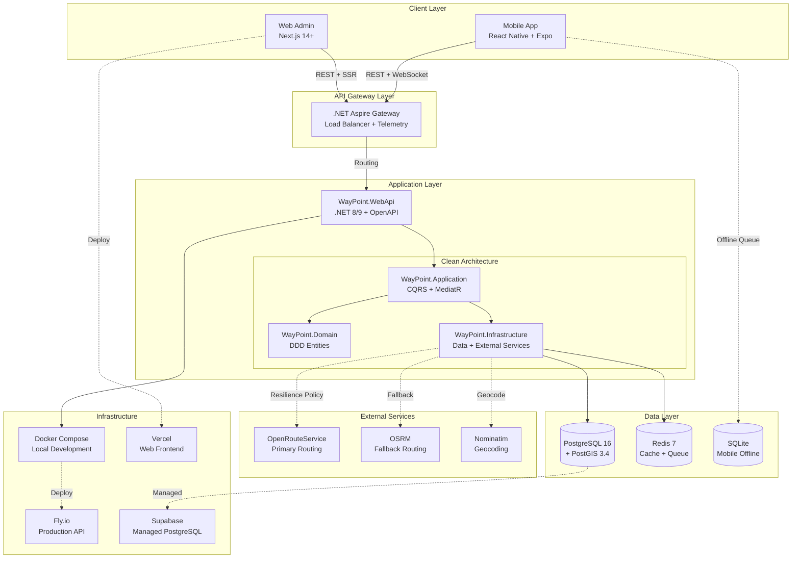
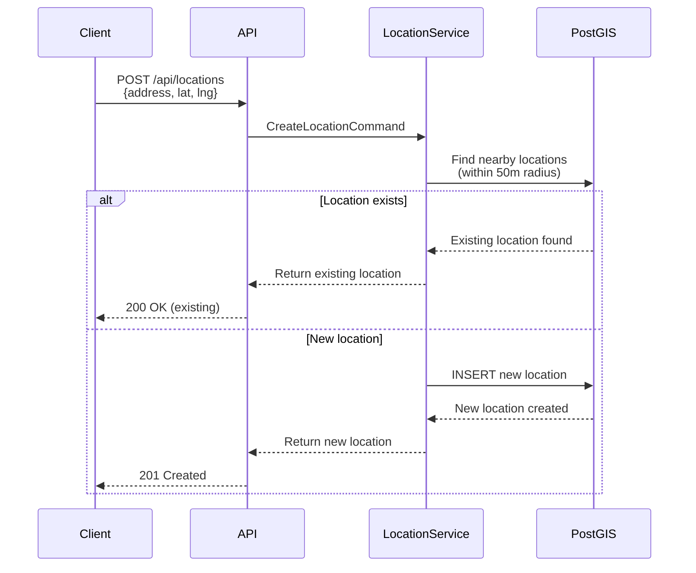
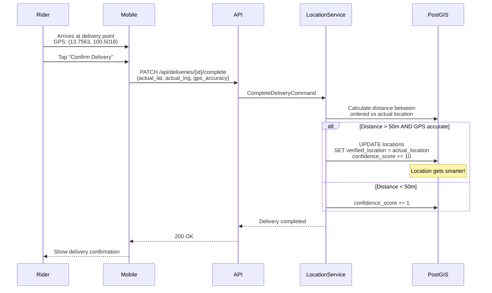

# 🚀 WayPoint System Blueprint & Tech Stack

## 📋 Executive Summary

**WayPoint** is an enterprise-grade routing and delivery management system built around the concept of **"Location Intelligence Loop"** - a system that becomes smarter with every delivery through verified GPS feedback.

### Core Philosophy
- **Open Source First**: Minimize vendor lock-in
- **Cost-Effective**: Leverage free tiers and self-hosted solutions
- **Learning System**: Improve location accuracy through real-world delivery data
- **Offline-First**: Mobile apps must work without constant connectivity

---

## 🏗️ System Architecture Overview



---

## 🛠️ Technology Stack Deep Dive

### Backend Stack

| Technology | Version | Purpose | Why This Choice? |
|------------|---------|---------|------------------|
| **.NET 8/9** | 8.0 LTS / 9.0 | Core Framework | • Native performance (AOT compilation)<br/>• Built-in OpenTelemetry<br/>• Excellent GIS library support<br/>• Cross-platform deployment |
| **PostgreSQL** | 16+ | Primary Database | • ACID compliance for delivery tracking<br/>• Mature replication for HA<br/>• Best-in-class JSON support |
| **PostGIS** | 3.4+ | Spatial Database | • Industry-standard GIS extension<br/>• Native geography types (spheroid calculations)<br/>• GIST indexing for fast spatial queries<br/>• Better than MySQL's spatial or MongoDB's geo queries |
| **Redis** | 7.x | Cache & Queue | • Sub-millisecond latency for hot routes<br/>• Pub/Sub for real-time rider updates<br/>• Rate limiting for API calls<br/>• Free tier: Upstash (10K commands/day) |
| **MediatR** | Latest | CQRS Pattern | • Clean separation of commands/queries<br/>• Pipeline behaviors (validation, logging)<br/>• Testability through handlers |
| **FluentValidation** | Latest | Input Validation | • Expressive validation rules<br/>• Automatic OpenAPI integration<br/>• Better than Data Annotations |
| **Polly** | Latest | Resilience | • Retry policies for external APIs<br/>• Circuit breaker for failing services<br/>• Fallback strategies (ORS → OSRM) |
| **NetTopologySuite** | Latest | GIS Library | • .NET port of JTS (Java Topology Suite)<br/>• Works seamlessly with PostGIS<br/>• Spatial operations (distance, contains, intersection) |

### Frontend Stack

| Technology | Purpose | Why This Choice? |
|------------|---------|------------------|
| **Next.js 14+** | Web Admin Panel | • App Router for modern React patterns<br/>• Server Components reduce bundle size<br/>• Built-in API routes for BFF pattern<br/>• Vercel deployment in 2 minutes |
| **React Native + Expo** | Mobile App | • Single codebase for iOS/Android<br/>• Expo Go for rapid testing<br/>• Native maps (react-native-maps)<br/>• Background geolocation support |
| **TanStack Query** | Server State | • Automatic caching & refetching<br/>• Optimistic updates for better UX<br/>• Better than Redux for API data |
| **Zustand** | Client State | • Lightweight (1KB)<br/>• No boilerplate like Redux<br/>• Perfect for UI state (selected route, filters) |
| **Mapbox GL JS** | Web Maps | • Free tier: 50K loads/month<br/>• Custom styling with MapTiler<br/>• Better rendering than Google Maps |
| **react-native-maps** | Mobile Maps | • Native performance<br/>• Supports both Google/Apple Maps<br/>• Offline tile caching |
| **SQLite / WatermelonDB** | Mobile Offline DB | • Reactive database for React Native<br/>• Observables for real-time UI updates<br/>• Essential for offline-first architecture |

### DevOps & Infrastructure

| Technology | Purpose | Free Tier Limits |
|------------|---------|------------------|
| **Docker Compose** | Local Development | N/A (Local) |
| **Fly.io** | API Hosting | 3 VMs, 3GB storage, 160GB transfer |
| **Supabase** | Managed PostgreSQL | 500MB database, unlimited API requests |
| **Vercel** | Web Hosting | Unlimited deployments, 100GB bandwidth |
| **GitHub Actions** | CI/CD | 2,000 minutes/month |
| **Upstash Redis** | Managed Redis | 10,000 commands/day |
| **.NET Aspire** | Orchestration | Local development dashboard |

### GIS & Routing Services

| Service | Purpose | Free Tier | Fallback Strategy |
|---------|---------|-----------|-------------------|
| **OpenRouteService** | Primary Routing | 2,000 requests/day | → OSRM |
| **OSRM** | Backup Routing | Unlimited (self-hosted) | N/A |
| **Nominatim** | Geocoding | 1 req/sec (public) | → PostGIS reverse geocode |
| **Overpass API** | POI Data | Unlimited (usage policy) | Cache in PostgreSQL |

---

## 🔐 Why PostGIS Over Standard PostgreSQL?

### Standard PostgreSQL Limitations
```sql
-- ❌ Inaccurate distance (treats Earth as flat)
SELECT *, 
  SQRT(POW(lat - 13.7563, 2) + POW(lng - 100.5018, 2)) AS distance
FROM locations
WHERE lat BETWEEN 13.7 AND 13.8
  AND lng BETWEEN 100.4 AND 100.6
ORDER BY distance;
```

### PostGIS Advantages
```sql
-- ✅ Accurate spheroid distance + spatial index
SELECT 
  id,
  address,
  ST_Distance(
    location::geography,
    ST_SetSRID(ST_MakePoint(100.5018, 13.7563), 4326)::geography
  ) AS distance_meters
FROM locations
WHERE ST_DWithin(
  location::geography,
  ST_SetSRID(ST_MakePoint(100.5018, 13.7563), 4326)::geography,
  5000  -- 5km radius
)
ORDER BY location <-> ST_SetSRID(ST_MakePoint(100.5018, 13.7563), 4326)
LIMIT 10;
```

**Key Benefits:**
- **Accuracy**: Haversine formula for spheroid Earth calculations
- **Performance**: GIST indexes make spatial queries 100x faster
- **Standards**: OGC-compliant (interoperable with QGIS, ArcGIS)
- **Features**: Geocoding, routing, clustering built-in

---

## 📝 Detailed .gitignore (Multi-Project)

```gitignore
# ============================================
# ROOT LEVEL
# ============================================
*.log
*.env
*.env.local
.DS_Store
Thumbs.db
.vscode/
.idea/

# ============================================
# BACKEND (.NET)
# ============================================
# Build outputs
**/bin/
**/obj/
**/out/

# User-specific files
*.user
*.suo
*.userosscache
*.sln.docstates

# .NET Core
project.lock.json
project.fragment.lock.json
artifacts/
**/Properties/launchSettings.json

# ASP.NET Scaffolding
ScaffoldingReadMe.txt

# .NET Aspire
**/.aspire/
**/aspire-manifest.json

# Test Coverage
**/coverage/
**/TestResults/

# ============================================
# FRONTEND (Next.js)
# ============================================
**/node_modules/
**/.next/
**/out/
**/build/
**/.vercel/

# Testing
**/.nyc_output/
**/coverage/

# Environment
.env*.local

# Logs
npm-debug.log*
yarn-debug.log*
yarn-error.log*

# ============================================
# MOBILE (React Native + Expo)
# ============================================
# Expo
**/.expo/
**/.expo-shared/
**/dist/
**/web-build/

# React Native
**/android/app/build/
**/android/.gradle/
**/ios/Pods/
**/ios/build/

# Metro
**/.metro-health-check*

# ============================================
# DATABASE
# ============================================
**/postgres-data/
**/redis-data/
*.db
*.db-shm
*.db-wal

# Migrations (keep tracked, but ignore sensitive data)
**/Migrations/*.cs.user

# ============================================
# DOCKER
# ============================================
docker-compose.override.yml
**/volumes/

# ============================================
# TERRAFORM / IaC
# ============================================
**/.terraform/
**/.terraform.lock.hcl
*.tfstate
*.tfstate.backup

# ============================================
# IDE SPECIFIC
# ============================================
# JetBrains Rider
**/.idea/
*.sln.iml

# Visual Studio Code
**/.vscode/
!.vscode/extensions.json
!.vscode/tasks.json

# ============================================
# SECURITY (NEVER COMMIT)
# ============================================
**/secrets/
**/credentials/
**/*.pem
**/*.key
**/*.p12
**/*.pfx
**/appsettings.Production.json
**/google-services.json
**/GoogleService-Info.plist
```

---

## 🎯 Architecture Principles

### 1. **Clean Architecture Layers**
```
┌─────────────────────────────────────┐
│   Presentation (WebApi, Mobile)    │
├─────────────────────────────────────┤
│   Application (Use Cases, CQRS)    │
├─────────────────────────────────────┤
│   Domain (Entities, Value Objects)  │
├─────────────────────────────────────┤
│   Infrastructure (Data, External)   │
└─────────────────────────────────────┘
```

**Dependency Rule**: Inner layers never depend on outer layers

### 2. **CQRS Pattern**
- **Commands**: Modify state (CreateDeliveryCommand)
- **Queries**: Read state (GetOptimizedRouteQuery)
- **Benefits**: Separate scalability, caching strategies

### 3. **Domain-Driven Design**
- **Entities**: Delivery, Rider, Location (with identity)
- **Value Objects**: LatLng, Address (immutable, no identity)
- **Domain Events**: DeliveryCompletedEvent → Update location confidence

### 4. **Resilience Patterns**
```csharp
// Polly Policy Example
var retryPolicy = Policy
  .Handle<HttpRequestException>()
  .WaitAndRetryAsync(3, retryAttempt => 
    TimeSpan.FromSeconds(Math.Pow(2, retryAttempt)));

var circuitBreaker = Policy
  .Handle<HttpRequestException>()
  .CircuitBreakerAsync(5, TimeSpan.FromMinutes(1));

var fallback = Policy<RouteResponse>
  .Handle<Exception>()
  .FallbackAsync(async ct => 
    await _osrmService.GetRouteAsync(request, ct));
```

---

## 🔄 System Workflows

### Workflow 1: Smart Location Deduplication


### Workflow 2: Location Learning Loop


---

## 📊 Performance Targets

| Metric | Target | Measurement |
|--------|--------|-------------|
| API Response Time (P95) | < 200ms | OpenTelemetry traces |
| Route Calculation | < 3s for 50 waypoints | Custom timer |
| Database Query | < 50ms for spatial queries | PostgreSQL logs |
| Mobile App Start | < 2s cold start | Expo performance monitor |
| Redis Cache Hit Rate | > 80% | Redis INFO stats |
| PostGIS Index Usage | 100% on spatial queries | EXPLAIN ANALYZE |

---

## 🚀 Next Steps

1. ✅ Review this architecture document
2. → Proceed to **Page 2**: Detailed Directory Structure
3. → Proceed to **Page 3**: Database & GIS Deep Dive
4. → Proceed to **Page 4**: Task Roadmap & Deployment

---

## 📚 References

- [PostGIS Documentation](https://postgis.net/docs/)
- [.NET Clean Architecture](https://github.com/jasontaylordev/CleanArchitecture)
- [OpenRouteService API](https://openrouteservice.org/dev/#/api-docs)
- [MediatR GitHub](https://github.com/jbogard/MediatR)
- [React Native Maps](https://github.com/react-native-maps/react-native-maps)

---

**Document Version**: 1.0  
**Last Updated**: February 2026  
**Author**: Senior System Architect  
**Status**: Ready for Implementation
