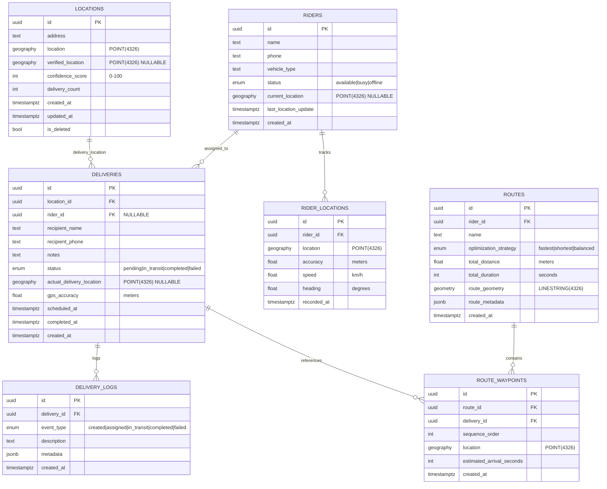
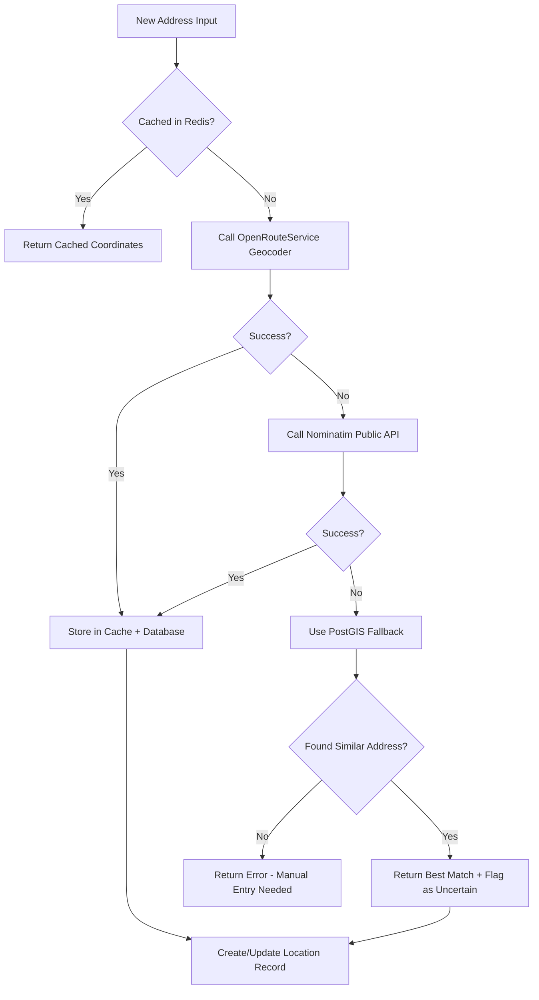

# 🗄️ Database & GIS Deep Dive

## 📊 Database Schema Overview

### Entity Relationship Diagram (ERD)



---

## 🚀 Database Setup Scripts

### Script 1: Initialize PostGIS Extension

```sql
-- ============================================
-- WayPoint Database Initialization
-- PostgreSQL 16+ with PostGIS 3.4+
-- ============================================

-- Create database
CREATE DATABASE waypoint
    WITH 
    OWNER = postgres
    ENCODING = 'UTF8'
    LC_COLLATE = 'en_US.utf8'
    LC_CTYPE = 'en_US.utf8'
    TABLESPACE = pg_default
    CONNECTION LIMIT = -1;

-- Connect to the database
\c waypoint

-- Enable required extensions
CREATE EXTENSION IF NOT EXISTS "uuid-ossp";      -- UUID generation
CREATE EXTENSION IF NOT EXISTS "postgis";        -- Core GIS functionality
CREATE EXTENSION IF NOT EXISTS "postgis_topology"; -- Topology support
CREATE EXTENSION IF NOT EXISTS "fuzzystrmatch";  -- Fuzzy string matching
CREATE EXTENSION IF NOT EXISTS "postgis_tiger_geocoder"; -- Optional: US geocoding

-- Verify PostGIS installation
SELECT PostGIS_Full_Version();

-- Expected output:
-- POSTGIS="3.4.x" [EXTENSION] PGSQL="16.x" GEOS="3.12.x" PROJ="9.x" LIBXML="2.x"

-- ============================================
-- Performance Configuration
-- ============================================

-- Increase shared buffers for spatial queries (adjust based on available RAM)
ALTER SYSTEM SET shared_buffers = '256MB';
ALTER SYSTEM SET effective_cache_size = '1GB';
ALTER SYSTEM SET work_mem = '16MB';
ALTER SYSTEM SET maintenance_work_mem = '128MB';

-- Enable parallel query execution
ALTER SYSTEM SET max_parallel_workers_per_gather = 4;

-- Reload configuration
SELECT pg_reload_conf();

-- ============================================
-- Create Custom Types
-- ============================================

-- Delivery status enum
CREATE TYPE delivery_status AS ENUM (
    'pending',
    'assigned',
    'in_transit',
    'completed',
    'failed',
    'cancelled'
);

-- Rider status enum
CREATE TYPE rider_status AS ENUM (
    'available',
    'busy',
    'offline',
    'on_break'
);

-- Route optimization strategy
CREATE TYPE optimization_strategy AS ENUM (
    'fastest',
    'shortest',
    'balanced',
    'avoid_traffic'
);

-- Delivery log event type
CREATE TYPE delivery_event_type AS ENUM (
    'created',
    'assigned',
    'in_transit',
    'arrived',
    'completed',
    'failed',
    'cancelled',
    'rescheduled'
);

-- Location confidence level
CREATE TYPE confidence_level AS ENUM (
    'low',        -- 0-30 score
    'medium',     -- 31-60 score
    'high',       -- 61-90 score
    'verified'    -- 91-100 score
);

-- ============================================
-- Helper Functions
-- ============================================

-- Function to calculate confidence level from score
CREATE OR REPLACE FUNCTION get_confidence_level(score INT)
RETURNS confidence_level AS $$
BEGIN
    RETURN CASE
        WHEN score >= 91 THEN 'verified'::confidence_level
        WHEN score >= 61 THEN 'high'::confidence_level
        WHEN score >= 31 THEN 'medium'::confidence_level
        ELSE 'low'::confidence_level
    END;
END;
$$ LANGUAGE plpgsql IMMUTABLE;

-- Function to update updated_at timestamp
CREATE OR REPLACE FUNCTION update_updated_at_column()
RETURNS TRIGGER AS $$
BEGIN
    NEW.updated_at = CURRENT_TIMESTAMP;
    RETURN NEW;
END;
$$ LANGUAGE plpgsql;
```

### Script 2: Create Core Tables

```sql
-- ============================================
-- LOCATIONS Table (Core GIS Entity)
-- ============================================

CREATE TABLE locations (
    id UUID PRIMARY KEY DEFAULT uuid_generate_v4(),
    
    -- Address information
    address TEXT NOT NULL,
    address_line2 TEXT,
    district TEXT,
    city TEXT,
    province TEXT,
    postal_code VARCHAR(10),
    country VARCHAR(2) DEFAULT 'TH',
    
    -- Geographic data (SRID 4326 = WGS84)
    location GEOGRAPHY(POINT, 4326) NOT NULL,
    verified_location GEOGRAPHY(POINT, 4326),
    
    -- Location intelligence
    confidence_score INT NOT NULL DEFAULT 0 CHECK (confidence_score BETWEEN 0 AND 100),
    confidence_level confidence_level GENERATED ALWAYS AS (
        get_confidence_level(confidence_score)
    ) STORED,
    delivery_count INT NOT NULL DEFAULT 0,
    last_delivery_at TIMESTAMPTZ,
    
    -- Metadata
    place_name TEXT,                    -- POI name (e.g., "Starbucks Central World")
    place_type TEXT,                    -- residential, commercial, industrial
    access_notes TEXT,                  -- "Gate code: 1234", "Back entrance"
    
    -- Audit fields
    created_at TIMESTAMPTZ NOT NULL DEFAULT CURRENT_TIMESTAMP,
    updated_at TIMESTAMPTZ NOT NULL DEFAULT CURRENT_TIMESTAMP,
    created_by TEXT,
    updated_by TEXT,
    is_deleted BOOLEAN NOT NULL DEFAULT FALSE,
    
    -- Constraints
    CONSTRAINT location_or_verified_required 
        CHECK (location IS NOT NULL OR verified_location IS NOT NULL)
);

-- Indexes for locations
CREATE INDEX idx_locations_geography ON locations USING GIST(location);
CREATE INDEX idx_locations_verified_geography ON locations USING GIST(verified_location) 
    WHERE verified_location IS NOT NULL;
CREATE INDEX idx_locations_confidence ON locations(confidence_score DESC);
CREATE INDEX idx_locations_delivery_count ON locations(delivery_count DESC);
CREATE INDEX idx_locations_address_gin ON locations USING GIN(to_tsvector('english', address));
CREATE INDEX idx_locations_not_deleted ON locations(is_deleted) WHERE is_deleted = FALSE;

-- Trigger for updated_at
CREATE TRIGGER update_locations_updated_at
    BEFORE UPDATE ON locations
    FOR EACH ROW
    EXECUTE FUNCTION update_updated_at_column();

-- ============================================
-- RIDERS Table
-- ============================================

CREATE TABLE riders (
    id UUID PRIMARY KEY DEFAULT uuid_generate_v4(),
    
    -- Personal information
    name TEXT NOT NULL,
    phone VARCHAR(20) NOT NULL UNIQUE,
    email VARCHAR(255),
    
    -- Vehicle information
    vehicle_type VARCHAR(50) NOT NULL, -- motorcycle, car, bicycle
    vehicle_plate VARCHAR(20),
    
    -- Status
    status rider_status NOT NULL DEFAULT 'offline',
    current_location GEOGRAPHY(POINT, 4326),
    last_location_update TIMESTAMPTZ,
    
    -- Statistics
    total_deliveries INT NOT NULL DEFAULT 0,
    successful_deliveries INT NOT NULL DEFAULT 0,
    average_rating DECIMAL(3, 2),
    
    -- Audit fields
    created_at TIMESTAMPTZ NOT NULL DEFAULT CURRENT_TIMESTAMP,
    updated_at TIMESTAMPTZ NOT NULL DEFAULT CURRENT_TIMESTAMP,
    is_active BOOLEAN NOT NULL DEFAULT TRUE,
    is_deleted BOOLEAN NOT NULL DEFAULT FALSE
);

-- Indexes for riders
CREATE INDEX idx_riders_status ON riders(status) WHERE is_deleted = FALSE;
CREATE INDEX idx_riders_current_location ON riders USING GIST(current_location) 
    WHERE current_location IS NOT NULL AND is_deleted = FALSE;
CREATE INDEX idx_riders_phone ON riders(phone) WHERE is_deleted = FALSE;

CREATE TRIGGER update_riders_updated_at
    BEFORE UPDATE ON riders
    FOR EACH ROW
    EXECUTE FUNCTION update_updated_at_column();

-- ============================================
-- DELIVERIES Table
-- ============================================

CREATE TABLE deliveries (
    id UUID PRIMARY KEY DEFAULT uuid_generate_v4(),
    
    -- Foreign keys
    location_id UUID NOT NULL REFERENCES locations(id),
    rider_id UUID REFERENCES riders(id),
    
    -- Recipient information
    recipient_name TEXT NOT NULL,
    recipient_phone VARCHAR(20) NOT NULL,
    
    -- Delivery details
    status delivery_status NOT NULL DEFAULT 'pending',
    notes TEXT,
    special_instructions TEXT,
    
    -- Actual delivery data (captured on completion)
    actual_delivery_location GEOGRAPHY(POINT, 4326),
    gps_accuracy REAL,                  -- meters
    distance_from_original REAL,        -- meters (calculated)
    
    -- Timing
    scheduled_at TIMESTAMPTZ,
    assigned_at TIMESTAMPTZ,
    started_at TIMESTAMPTZ,
    arrived_at TIMESTAMPTZ,
    completed_at TIMESTAMPTZ,
    
    -- Metadata
    delivery_code VARCHAR(20) UNIQUE,   -- QR code or tracking number
    package_size VARCHAR(20),           -- small, medium, large
    estimated_duration_seconds INT,
    
    -- Audit fields
    created_at TIMESTAMPTZ NOT NULL DEFAULT CURRENT_TIMESTAMP,
    updated_at TIMESTAMPTZ NOT NULL DEFAULT CURRENT_TIMESTAMP,
    is_deleted BOOLEAN NOT NULL DEFAULT FALSE,
    
    -- Constraints
    CONSTRAINT status_timestamp_consistency CHECK (
        (status = 'assigned' AND assigned_at IS NOT NULL) OR
        (status = 'in_transit' AND started_at IS NOT NULL) OR
        (status = 'completed' AND completed_at IS NOT NULL) OR
        status IN ('pending', 'failed', 'cancelled')
    )
);

-- Indexes for deliveries
CREATE INDEX idx_deliveries_location ON deliveries(location_id) WHERE is_deleted = FALSE;
CREATE INDEX idx_deliveries_rider ON deliveries(rider_id) WHERE is_deleted = FALSE;
CREATE INDEX idx_deliveries_status ON deliveries(status) WHERE is_deleted = FALSE;
CREATE INDEX idx_deliveries_scheduled ON deliveries(scheduled_at DESC) WHERE is_deleted = FALSE;
CREATE INDEX idx_deliveries_actual_location ON deliveries USING GIST(actual_delivery_location) 
    WHERE actual_delivery_location IS NOT NULL;
CREATE INDEX idx_deliveries_code ON deliveries(delivery_code) WHERE is_deleted = FALSE;

CREATE TRIGGER update_deliveries_updated_at
    BEFORE UPDATE ON deliveries
    FOR EACH ROW
    EXECUTE FUNCTION update_updated_at_column();

-- ============================================
-- RIDER_LOCATIONS Table (GPS Tracking History)
-- ============================================

CREATE TABLE rider_locations (
    id UUID PRIMARY KEY DEFAULT uuid_generate_v4(),
    rider_id UUID NOT NULL REFERENCES riders(id),
    
    -- Location data
    location GEOGRAPHY(POINT, 4326) NOT NULL,
    accuracy REAL,                      -- meters
    altitude REAL,                      -- meters
    speed REAL,                         -- km/h
    heading REAL,                       -- degrees (0-360)
    
    -- Timing
    recorded_at TIMESTAMPTZ NOT NULL DEFAULT CURRENT_TIMESTAMP,
    
    -- Metadata
    battery_level INT,                  -- percentage
    is_moving BOOLEAN DEFAULT FALSE,
    
    -- Partitioning hint: Consider partitioning by recorded_at for time-series data
    CONSTRAINT valid_accuracy CHECK (accuracy >= 0),
    CONSTRAINT valid_heading CHECK (heading >= 0 AND heading <= 360)
);

-- Indexes for rider locations (time-series optimized)
CREATE INDEX idx_rider_locations_rider_time ON rider_locations(rider_id, recorded_at DESC);
CREATE INDEX idx_rider_locations_geography ON rider_locations USING GIST(location);
CREATE INDEX idx_rider_locations_time ON rider_locations(recorded_at DESC);

-- ============================================
-- ROUTES Table (Optimized Routes)
-- ============================================

CREATE TABLE routes (
    id UUID PRIMARY KEY DEFAULT uuid_generate_v4(),
    rider_id UUID NOT NULL REFERENCES riders(id),
    
    -- Route details
    name TEXT NOT NULL,
    optimization_strategy optimization_strategy NOT NULL DEFAULT 'balanced',
    
    -- Metrics
    total_distance REAL NOT NULL,       -- meters
    total_duration INT NOT NULL,        -- seconds
    waypoint_count INT NOT NULL,
    
    -- Geometry (full route line)
    route_geometry GEOMETRY(LINESTRING, 4326),
    
    -- Metadata
    route_metadata JSONB,               -- Store ORS/OSRM response
    is_active BOOLEAN NOT NULL DEFAULT TRUE,
    
    -- Audit fields
    created_at TIMESTAMPTZ NOT NULL DEFAULT CURRENT_TIMESTAMP,
    updated_at TIMESTAMPTZ NOT NULL DEFAULT CURRENT_TIMESTAMP
);

-- Indexes for routes
CREATE INDEX idx_routes_rider ON routes(rider_id, created_at DESC);
CREATE INDEX idx_routes_active ON routes(is_active) WHERE is_active = TRUE;
CREATE INDEX idx_routes_geometry ON routes USING GIST(route_geometry);

CREATE TRIGGER update_routes_updated_at
    BEFORE UPDATE ON routes
    FOR EACH ROW
    EXECUTE FUNCTION update_updated_at_column();

-- ============================================
-- ROUTE_WAYPOINTS Table (Route Stops)
-- ============================================

CREATE TABLE route_waypoints (
    id UUID PRIMARY KEY DEFAULT uuid_generate_v4(),
    route_id UUID NOT NULL REFERENCES routes(id) ON DELETE CASCADE,
    delivery_id UUID NOT NULL REFERENCES deliveries(id),
    
    -- Sequencing
    sequence_order INT NOT NULL,
    
    -- Location (denormalized for performance)
    location GEOGRAPHY(POINT, 4326) NOT NULL,
    
    -- Timing estimates
    estimated_arrival_seconds INT NOT NULL,
    estimated_service_time_seconds INT NOT NULL DEFAULT 300, -- 5 minutes default
    
    -- Actual data (filled during delivery)
    actual_arrival_at TIMESTAMPTZ,
    actual_departure_at TIMESTAMPTZ,
    
    created_at TIMESTAMPTZ NOT NULL DEFAULT CURRENT_TIMESTAMP,
    
    -- Constraints
    CONSTRAINT unique_route_sequence UNIQUE (route_id, sequence_order),
    CONSTRAINT unique_route_delivery UNIQUE (route_id, delivery_id)
);

-- Indexes for route waypoints
CREATE INDEX idx_waypoints_route_sequence ON route_waypoints(route_id, sequence_order);
CREATE INDEX idx_waypoints_delivery ON route_waypoints(delivery_id);
CREATE INDEX idx_waypoints_location ON route_waypoints USING GIST(location);

-- ============================================
-- DELIVERY_LOGS Table (Audit Trail)
-- ============================================

CREATE TABLE delivery_logs (
    id UUID PRIMARY KEY DEFAULT uuid_generate_v4(),
    delivery_id UUID NOT NULL REFERENCES deliveries(id),
    
    -- Event details
    event_type delivery_event_type NOT NULL,
    description TEXT,
    
    -- Context
    performer_id UUID,                  -- Who performed the action (rider_id or user_id)
    performer_type VARCHAR(20),         -- rider, admin, system
    
    -- Additional data
    metadata JSONB,                     -- Store any additional context
    
    created_at TIMESTAMPTZ NOT NULL DEFAULT CURRENT_TIMESTAMP
);

-- Indexes for delivery logs
CREATE INDEX idx_delivery_logs_delivery ON delivery_logs(delivery_id, created_at DESC);
CREATE INDEX idx_delivery_logs_event_type ON delivery_logs(event_type);
CREATE INDEX idx_delivery_logs_time ON delivery_logs(created_at DESC);

-- ============================================
-- Views for Common Queries
-- ============================================

-- View: High-confidence locations
CREATE OR REPLACE VIEW high_confidence_locations AS
SELECT 
    id,
    address,
    ST_Y(location::geometry) AS latitude,
    ST_X(location::geometry) AS longitude,
    confidence_score,
    confidence_level,
    delivery_count,
    last_delivery_at
FROM locations
WHERE confidence_level IN ('high', 'verified')
    AND is_deleted = FALSE
ORDER BY confidence_score DESC, delivery_count DESC;

-- View: Active deliveries with location details
CREATE OR REPLACE VIEW active_deliveries_with_location AS
SELECT 
    d.id AS delivery_id,
    d.delivery_code,
    d.status,
    d.recipient_name,
    d.recipient_phone,
    l.address,
    ST_Y(l.location::geometry) AS latitude,
    ST_X(l.location::geometry) AS longitude,
    l.confidence_score,
    r.name AS rider_name,
    r.phone AS rider_phone,
    r.vehicle_type,
    d.scheduled_at,
    d.created_at
FROM deliveries d
INNER JOIN locations l ON d.location_id = l.id
LEFT JOIN riders r ON d.rider_id = r.id
WHERE d.status IN ('pending', 'assigned', 'in_transit')
    AND d.is_deleted = FALSE
ORDER BY d.scheduled_at ASC NULLS LAST;

-- View: Rider performance summary
CREATE OR REPLACE VIEW rider_performance AS
SELECT 
    r.id AS rider_id,
    r.name,
    r.status,
    r.total_deliveries,
    r.successful_deliveries,
    CASE 
        WHEN r.total_deliveries > 0 
        THEN ROUND((r.successful_deliveries::DECIMAL / r.total_deliveries) * 100, 2)
        ELSE 0 
    END AS success_rate,
    r.average_rating,
    COUNT(d.id) FILTER (WHERE d.status = 'in_transit') AS current_deliveries,
    r.last_location_update
FROM riders r
LEFT JOIN deliveries d ON r.id = d.rider_id AND d.status = 'in_transit'
WHERE r.is_deleted = FALSE
GROUP BY r.id
ORDER BY r.status, success_rate DESC;
```

### Script 3: Location Intelligence Functions

```sql
-- ============================================
-- 🧠 LOCATION LEARNING FUNCTIONS
-- ============================================

-- Function: Find nearby location within radius
CREATE OR REPLACE FUNCTION find_nearby_location(
    p_latitude DOUBLE PRECISION,
    p_longitude DOUBLE PRECISION,
    p_radius_meters DOUBLE PRECISION DEFAULT 50
)
RETURNS TABLE (
    id UUID,
    address TEXT,
    distance_meters DOUBLE PRECISION,
    confidence_score INT,
    delivery_count INT
) AS $$
BEGIN
    RETURN QUERY
    SELECT 
        l.id,
        l.address,
        ST_Distance(
            l.location,
            ST_SetSRID(ST_MakePoint(p_longitude, p_latitude), 4326)::geography
        ) AS distance_meters,
        l.confidence_score,
        l.delivery_count
    FROM locations l
    WHERE ST_DWithin(
        l.location,
        ST_SetSRID(ST_MakePoint(p_longitude, p_latitude), 4326)::geography,
        p_radius_meters
    )
    AND l.is_deleted = FALSE
    ORDER BY distance_meters ASC
    LIMIT 1;
END;
$$ LANGUAGE plpgsql STABLE;

-- Function: Update location confidence after delivery
CREATE OR REPLACE FUNCTION update_location_confidence(
    p_location_id UUID,
    p_actual_latitude DOUBLE PRECISION,
    p_actual_longitude DOUBLE PRECISION,
    p_gps_accuracy REAL
)
RETURNS VOID AS $$
DECLARE
    v_distance REAL;
    v_current_score INT;
    v_score_increment INT;
BEGIN
    -- Get current location and score
    SELECT 
        ST_Distance(
            location,
            ST_SetSRID(ST_MakePoint(p_actual_longitude, p_actual_latitude), 4326)::geography
        ),
        confidence_score
    INTO v_distance, v_current_score
    FROM locations
    WHERE id = p_location_id;
    
    -- Determine score increment based on accuracy and distance
    IF p_gps_accuracy <= 10 THEN  -- High accuracy GPS
        IF v_distance <= 20 THEN
            v_score_increment := 15;  -- Very accurate delivery
        ELSIF v_distance <= 50 THEN
            v_score_increment := 10;
        ELSIF v_distance <= 100 THEN
            v_score_increment := 5;
        ELSE
            v_score_increment := 2;
        END IF;
    ELSIF p_gps_accuracy <= 30 THEN  -- Medium accuracy
        v_score_increment := LEAST(v_score_increment / 2, 5);
    ELSE  -- Low accuracy - minimal increment
        v_score_increment := 1;
    END IF;
    
    -- Update location
    UPDATE locations
    SET 
        verified_location = CASE 
            WHEN v_distance > 50 AND p_gps_accuracy <= 10 
            THEN ST_SetSRID(ST_MakePoint(p_actual_longitude, p_actual_latitude), 4326)::geography
            ELSE verified_location
        END,
        confidence_score = LEAST(confidence_score + v_score_increment, 100),
        delivery_count = delivery_count + 1,
        last_delivery_at = CURRENT_TIMESTAMP,
        updated_at = CURRENT_TIMESTAMP
    WHERE id = p_location_id;
    
    RAISE NOTICE 'Updated location % - Distance: %m, Score increment: %', 
        p_location_id, v_distance, v_score_increment;
END;
$$ LANGUAGE plpgsql;

-- Function: Get locations needing verification (low confidence + multiple deliveries)
CREATE OR REPLACE FUNCTION get_locations_needing_verification()
RETURNS TABLE (
    id UUID,
    address TEXT,
    confidence_score INT,
    delivery_count INT,
    last_delivery_at TIMESTAMPTZ
) AS $$
BEGIN
    RETURN QUERY
    SELECT 
        l.id,
        l.address,
        l.confidence_score,
        l.delivery_count,
        l.last_delivery_at
    FROM locations l
    WHERE l.delivery_count >= 3
        AND l.confidence_score < 50
        AND l.verified_location IS NULL
        AND l.is_deleted = FALSE
    ORDER BY l.delivery_count DESC, l.confidence_score ASC
    LIMIT 100;
END;
$$ LANGUAGE plpgsql STABLE;

-- Function: Spatial clustering for location analysis
CREATE OR REPLACE FUNCTION cluster_nearby_locations(
    p_cluster_distance_meters DOUBLE PRECISION DEFAULT 100
)
RETURNS TABLE (
    cluster_id INT,
    location_count BIGINT,
    avg_confidence NUMERIC,
    center_point GEOGRAPHY
) AS $$
BEGIN
    RETURN QUERY
    WITH clustered AS (
        SELECT 
            id,
            location,
            confidence_score,
            ST_ClusterDBSCAN(location::geometry, eps := p_cluster_distance_meters, minpoints := 2) 
                OVER () AS cluster_id
        FROM locations
        WHERE is_deleted = FALSE
    )
    SELECT 
        c.cluster_id,
        COUNT(*) AS location_count,
        ROUND(AVG(c.confidence_score), 2) AS avg_confidence,
        ST_Centroid(ST_Union(c.location::geometry))::geography AS center_point
    FROM clustered c
    WHERE c.cluster_id IS NOT NULL
    GROUP BY c.cluster_id
    HAVING COUNT(*) >= 3
    ORDER BY location_count DESC;
END;
$$ LANGUAGE plpgsql STABLE;
```

### Script 4: Routing & Distance Functions

```sql
-- ============================================
-- 🗺️ ROUTING HELPER FUNCTIONS
-- ============================================

-- Function: Calculate route distance matrix for multiple waypoints
CREATE OR REPLACE FUNCTION calculate_distance_matrix(
    p_waypoint_locations GEOGRAPHY[]
)
RETURNS TABLE (
    origin_index INT,
    destination_index INT,
    distance_meters DOUBLE PRECISION
) AS $$
DECLARE
    v_count INT;
    v_i INT;
    v_j INT;
BEGIN
    v_count := array_length(p_waypoint_locations, 1);
    
    FOR v_i IN 1..v_count LOOP
        FOR v_j IN 1..v_count LOOP
            IF v_i <> v_j THEN
                RETURN QUERY
                SELECT 
                    v_i,
                    v_j,
                    ST_Distance(p_waypoint_locations[v_i], p_waypoint_locations[v_j]);
            END IF;
        END LOOP;
    END LOOP;
END;
$$ LANGUAGE plpgsql IMMUTABLE;

-- Function: Find nearest available rider to a location
CREATE OR REPLACE FUNCTION find_nearest_rider(
    p_latitude DOUBLE PRECISION,
    p_longitude DOUBLE PRECISION,
    p_max_distance_meters DOUBLE PRECISION DEFAULT 5000
)
RETURNS TABLE (
    rider_id UUID,
    rider_name TEXT,
    distance_meters DOUBLE PRECISION,
    eta_seconds INT
) AS $$
BEGIN
    RETURN QUERY
    SELECT 
        r.id,
        r.name,
        ST_Distance(
            r.current_location,
            ST_SetSRID(ST_MakePoint(p_longitude, p_latitude), 4326)::geography
        ) AS distance_meters,
        -- Simple ETA: distance / average_speed (assume 30 km/h = 8.33 m/s)
        ROUND(
            ST_Distance(
                r.current_location,
                ST_SetSRID(ST_MakePoint(p_longitude, p_latitude), 4326)::geography
            ) / 8.33
        )::INT AS eta_seconds
    FROM riders r
    WHERE r.status = 'available'
        AND r.current_location IS NOT NULL
        AND r.is_deleted = FALSE
        AND ST_DWithin(
            r.current_location,
            ST_SetSRID(ST_MakePoint(p_longitude, p_latitude), 4326)::geography,
            p_max_distance_meters
        )
    ORDER BY distance_meters ASC
    LIMIT 5;
END;
$$ LANGUAGE plpgsql STABLE;

-- Function: Get delivery hotspots (areas with most deliveries)
CREATE OR REPLACE FUNCTION get_delivery_hotspots(
    p_grid_size_meters DOUBLE PRECISION DEFAULT 1000
)
RETURNS TABLE (
    grid_id TEXT,
    delivery_count BIGINT,
    center_point GEOGRAPHY,
    avg_confidence NUMERIC
) AS $$
BEGIN
    RETURN QUERY
    WITH grid AS (
        SELECT 
            l.id,
            l.location,
            l.confidence_score,
            l.delivery_count,
            ST_SnapToGrid(l.location::geometry, p_grid_size_meters) AS grid_cell
        FROM locations l
        WHERE l.is_deleted = FALSE
    )
    SELECT 
        ST_AsText(g.grid_cell) AS grid_id,
        SUM(g.delivery_count) AS delivery_count,
        ST_Centroid(ST_Union(g.location::geometry))::geography AS center_point,
        ROUND(AVG(g.confidence_score), 2) AS avg_confidence
    FROM grid g
    GROUP BY g.grid_cell
    HAVING SUM(g.delivery_count) >= 10
    ORDER BY delivery_count DESC
    LIMIT 50;
END;
$$ LANGUAGE plpgsql STABLE;
```

---

## 🔄 Geocoding Fallback Strategy

### Strategy Flow



### Implementation Details

#### 1. **Primary: OpenRouteService Geocoding API**
```http
GET https://api.openrouteservice.org/geocode/search
?api_key=YOUR_KEY
&text=123 Sukhumvit Road, Bangkok
&boundary.country=TH
&size=1
```

**Limits**: 2,000 requests/day (Free Tier)

#### 2. **Fallback: Nominatim (OpenStreetMap)**
```http
GET https://nominatim.openstreetmap.org/search
?format=json
&q=123 Sukhumvit Road, Bangkok
&countrycodes=th
&limit=1
```

**Limits**: 1 request/second (Usage Policy)  
**Best Practice**: Always include `User-Agent` header

#### 3. **Last Resort: PostGIS Full-Text Search**
```sql
-- Search existing locations by address similarity
SELECT 
    id,
    address,
    ST_Y(location::geometry) AS latitude,
    ST_X(location::geometry) AS longitude,
    similarity(address, 'Sukhumvit Road') AS similarity_score
FROM locations
WHERE address % 'Sukhumvit Road'  -- pg_trgm operator
    AND is_deleted = FALSE
ORDER BY similarity_score DESC
LIMIT 5;
```

**Requirements**:
```sql
CREATE EXTENSION IF NOT EXISTS pg_trgm;
CREATE INDEX idx_locations_address_trgm ON locations USING GIN(address gin_trgm_ops);
```

---

## 📈 Performance Optimization Queries

### Query 1: Fastest Spatial Query (Using Index)
```sql
-- ❌ SLOW: Full table scan
SELECT * FROM locations
WHERE ST_Distance(
    location,
    ST_SetSRID(ST_MakePoint(100.5018, 13.7563), 4326)::geography
) < 1000;

-- ✅ FAST: Uses GIST index
SELECT * FROM locations
WHERE ST_DWithin(
    location,
    ST_SetSRID(ST_MakePoint(100.5018, 13.7563), 4326)::geography,
    1000
)
ORDER BY location <-> ST_SetSRID(ST_MakePoint(100.5018, 13.7563), 4326)::geometry
LIMIT 10;
```

### Query 2: Delivery Heatmap Data
```sql
-- Generate heatmap data for visualization
SELECT 
    ST_Y(location::geometry) AS lat,
    ST_X(location::geometry) AS lng,
    delivery_count AS weight,
    confidence_score
FROM locations
WHERE delivery_count > 0
    AND is_deleted = FALSE;
```

### Query 3: Route Optimization Data
```sql
-- Get all pending deliveries for a route
SELECT 
    d.id,
    d.delivery_code,
    l.address,
    ST_Y(l.location::geometry) AS latitude,
    ST_X(l.location::geometry) AS longitude,
    d.scheduled_at,
    d.estimated_duration_seconds
FROM deliveries d
INNER JOIN locations l ON d.location_id = l.id
WHERE d.status = 'pending'
    AND d.rider_id IS NULL
    AND d.is_deleted = FALSE
ORDER BY d.scheduled_at ASC
LIMIT 50;
```

---

## 🔐 Data Migration & Seeding

### Development Seed Data

```sql
-- ============================================
-- Seed Data for Development
-- ============================================

-- Insert sample locations (Bangkok area)
INSERT INTO locations (address, location, confidence_score, delivery_count) VALUES
('123 Sukhumvit Rd, Khlong Toei, Bangkok 10110', 
 ST_SetSRID(ST_MakePoint(100.5625, 13.7373), 4326)::geography, 85, 15),
('456 Silom Rd, Bang Rak, Bangkok 10500', 
 ST_SetSRID(ST_MakePoint(100.5282, 13.7248), 4326)::geography, 92, 23),
('789 Ratchadaphisek Rd, Din Daeng, Bangkok 10400', 
 ST_SetSRID(ST_MakePoint(100.5577, 13.7650), 4326)::geography, 78, 12);

-- Insert sample riders
INSERT INTO riders (name, phone, vehicle_type, status, current_location) VALUES
('Somchai Rider', '+66812345678', 'motorcycle', 'available', 
 ST_SetSRID(ST_MakePoint(100.5500, 13.7400), 4326)::geography),
('Nida Delivery', '+66823456789', 'motorcycle', 'busy', 
 ST_SetSRID(ST_MakePoint(100.5300, 13.7300), 4326)::geography);

-- Insert sample deliveries
INSERT INTO deliveries (location_id, recipient_name, recipient_phone, status) 
SELECT 
    id, 
    'Customer ' || ROW_NUMBER() OVER (),
    '+6681234567' || ROW_NUMBER() OVER (),
    'pending'
FROM locations
LIMIT 3;
```

---

## 🎯 Database Maintenance Tasks

### Routine Maintenance Script
```sql
-- Vacuum and analyze spatial tables
VACUUM ANALYZE locations;
VACUUM ANALYZE deliveries;
VACUUM ANALYZE rider_locations;

-- Reindex spatial indexes
REINDEX INDEX idx_locations_geography;
REINDEX INDEX idx_deliveries_actual_location;

-- Update statistics
ANALYZE locations;

-- Check index usage
SELECT 
    schemaname,
    tablename,
    indexname,
    idx_scan,
    idx_tup_read,
    idx_tup_fetch
FROM pg_stat_user_indexes
WHERE schemaname = 'public'
ORDER BY idx_scan DESC;
```

---

## ✅ Next Steps

1. ✅ Review database schema
2. ✅ Execute initialization scripts
3. → Proceed to **Page 4**: Task Roadmap & Deployment
4. Test PostGIS queries with sample data

---

**Document Version**: 1.0  
**Last Updated**: February 2026  
**Tested On**: PostgreSQL 16.1, PostGIS 3.4.1  
**Status**: Production Ready
